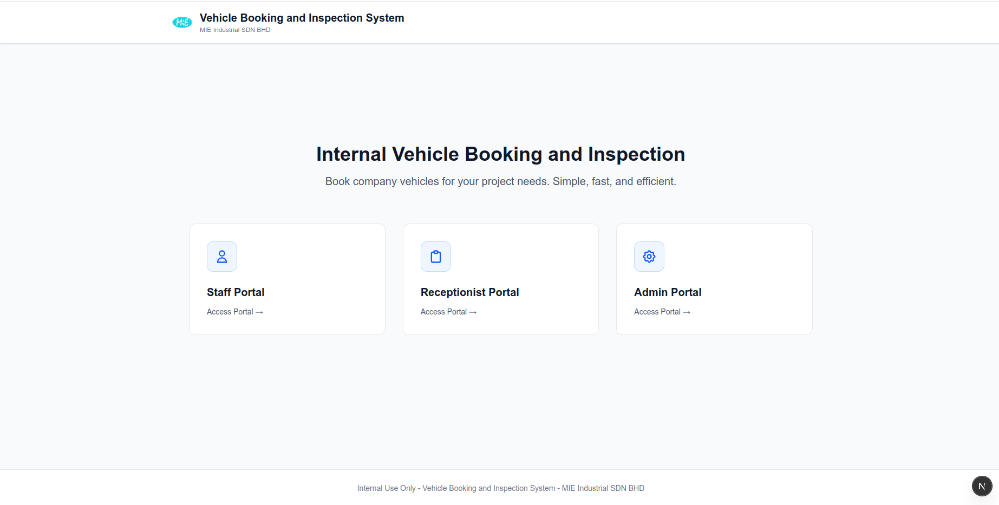

<div align="center">
  

  # Vehicle Booking and Inspection System

  <p>A comprehensive internal vehicle booking and inspection management system for MIE Industrial SDN BHD.</p>
  <p>This system streamlines the process of booking company vehicles, managing inspections, and tracking key collection/return processes.</p>
</div>

## 📋 Table of Contents

- [Features](#features)
- [System Overview](#system-overview)
- [Tech Stack](#tech-stack)
- [Getting Started](#getting-started)
- [Project Structure](#project-structure)
- [User Roles](#user-roles)
- [Future Enhancements](#future-enhancements)

## ✨ Features

### Staff Portal
- Create and manage vehicle booking requests
- Submit pre-inspection and post-inspection forms with photos
- View booking history and status
- Edit pending bookings
- Track key collection and return status

### Receptionist Portal
- Manage key collection and return processes
- View all bookings and their inspection forms
- Access booking history
- Track key management records

### Admin Portal
- Approve or reject booking requests
- Manage vehicle fleet (add, edit, delete vehicles)
- Manage staff accounts (create, edit, suspend accounts)
- View comprehensive booking history
- Oversee all system operations

### General Features
- Role-based authentication and access control
- Responsive design for mobile and desktop
- Real-time booking status updates
- PDF generation for inspection reports
- Image upload for vehicle inspections
- Comprehensive search and filtering

## 📸 System Overview

<div align="center">
  
  <p><i>Vehicle Booking and Inspection System Interface</i></p>
</div>

## 🛠️ Tech Stack

<div align="center">


</div>

- **Framework:** [Next.js 16](https://nextjs.org/) (App Router with Turbopack)
- **Language:** TypeScript
- **Styling:** Tailwind CSS
- **Authentication:** Firebase Authentication
- **Database:** Cloud Firestore
- **Storage:** Firebase Cloud Storage
- **PDF Generation:** @react-pdf/renderer
- **Icons:** React Icons (Material Design, Font Awesome)
- **Date Handling:** Native JavaScript Date API
- **Image Handling:** Next.js Image Component + Firebase Storage

## 🚀 Getting Started

### Prerequisites

- Node.js 18+ installed
- npm, yarn, pnpm, or bun package manager
- Firebase account and project

### Installation

1. Clone the repository:
```bash
git clone <repository-url>
cd vehicle-booking
```

2. Install dependencies:
```bash
npm install
# or
yarn install
# or
pnpm install
# or
bun install
```

3. Set up Firebase:
   - Create a Firebase project at [Firebase Console](https://console.firebase.google.com/)
   - Enable Authentication (Email/Password)
   - Enable Firestore Database
   - Enable Cloud Storage
   - Copy your Firebase configuration

4. Configure environment variables:
   - Copy `.env.example` to `.env.local`:
   ```bash
   cp .env.example .env.local
   ```
   - Fill in your Firebase credentials in `.env.local`:
   ```env
   NEXT_PUBLIC_FIREBASE_API_KEY=your_api_key
   NEXT_PUBLIC_FIREBASE_AUTH_DOMAIN=your_auth_domain
   NEXT_PUBLIC_FIREBASE_PROJECT_ID=your_project_id
   NEXT_PUBLIC_FIREBASE_STORAGE_BUCKET=your_storage_bucket
   NEXT_PUBLIC_FIREBASE_MESSAGING_SENDER_ID=your_sender_id
   NEXT_PUBLIC_FIREBASE_APP_ID=your_app_id
   NEXT_PUBLIC_FIREBASE_MEASUREMENT_ID=your_measurement_id
   ```

5. Run the development server:
```bash
npm run dev
# or
yarn dev
# or
pnpm dev
# or
bun dev
```

6. Open [http://localhost:3000](http://localhost:3000) in your browser to see the application.

### Build for Production

```bash
npm run build
npm run start
```

### Deployment to Vercel

1. Push your code to GitHub (make sure `.env.local` is gitignored)
2. Import your repository to Vercel
3. Add environment variables in Vercel dashboard:
   - Go to Project Settings → Environment Variables
   - Add all `NEXT_PUBLIC_FIREBASE_*` variables from your `.env.local`
4. Deploy!

**Important:** The Firebase configuration uses environment variables to keep credentials secure while allowing the app to work on Vercel.

## 📁 Project Structure

```
vehicle-booking/
├── app/                          # Next.js App Router pages
│   ├── admin/                    # Admin portal pages
│   │   ├── auth/                 # Admin authentication
│   │   ├── bookings/             # Booking management
│   │   │   └── [id]/             # Dynamic booking detail pages
│   │   │       ├── page.tsx      # Booking details
│   │   │       └── inspection/   # Inspection view
│   │   ├── history/              # Booking history
│   │   ├── staffs/               # Staff management
│   │   ├── vehicles/             # Vehicle management
│   │   │   └── [id]/             # Dynamic vehicle pages
│   │   └── account/              # Account settings
│   ├── receptionist/             # Receptionist portal pages
│   │   ├── auth/                 # Receptionist authentication
│   │   ├── bookings/             # Key management & inspections
│   │   │   └── [id]/inspection/  # Inspection forms
│   │   ├── history/              # Booking history
│   │   └── account/              # Account settings
│   ├── staff/                    # Staff portal pages
│   │   ├── auth/                 # Staff authentication
│   │   ├── bookings/             # Booking requests
│   │   │   ├── new/              # Create new booking
│   │   │   └── [id]/             # Dynamic booking pages
│   │   │       ├── page.tsx      # Booking details
│   │   │       ├── edit/         # Edit booking
│   │   │       └── inspection/   # Submit inspections
│   │   ├── history/              # Booking history
│   │   └── account/              # Account settings
│   ├── api/                      # API routes
│   │   └── image-proxy/          # Image proxy for Firebase Storage
│   ├── layout.tsx                # Root layout
│   ├── page.tsx                  # Homepage (portal selection)
│   └── globals.css               # Global styles
├── components/                   # Reusable React components
│   ├── AuthLoading.tsx           # Auth loading state
│   ├── BookingDetailsTable.tsx   # Booking details display
│   ├── BookingForm.tsx           # Booking request form
│   ├── BookingTable.tsx          # Booking list table
│   ├── Button.tsx                # Reusable button component
│   ├── Chip.tsx                  # Status chip component
│   ├── LoginForm.tsx             # Authentication form
│   ├── ManageAccountForm.tsx     # Account management
│   ├── PortalCard.tsx            # Portal selection card
│   ├── Sidebar.tsx               # Navigation sidebar
│   ├── StaffForm.tsx             # Staff creation/edit form
│   ├── VehicleForm.tsx           # Vehicle creation/edit form
│   ├── VehicleInspectionForm.tsx # Inspection form with photos
│   └── index.ts                  # Component exports
├── firebase/                     # Firebase configuration
│   ├── index.ts                  # Firebase initialization
│   ├── auth.ts                   # Authentication functions
│   ├── firestore.ts              # Firestore CRUD operations
│   └── storage.ts                # Storage operations
├── hooks/                        # Custom React hooks
│   └── useAuth.ts                # Authentication hook with role-based access
├── libs/                         # Library utilities
│   ├── InspectionFormRenderer.tsx # PDF report generator
│   └── vehicleAvailabilityChecker.ts # Vehicle availability logic
├── types/                        # TypeScript type definitions
│   ├── user.type.ts              # User, Staff, Admin, Receptionist
│   ├── vehicle.type.ts           # Vehicle type
│   ├── booking.type.ts           # Booking type
│   ├── inspection.type.ts        # Inspection type
│   └── index.ts                  # Type exports
├── constant/                     # Constants and configurations
│   ├── navLinks.ts               # Navigation links for each role
│   └── index.ts                  # Constant exports
├── public/                       # Static assets
│   └── logo.png                  # Company logo
├── .env.local                    # Environment variables (not committed)
├── .env.example                  # Environment variables template
├── package.json                  # Dependencies
├── tsconfig.json                 # TypeScript configuration
├── tailwind.config.ts            # Tailwind CSS configuration
└── README.md                     # Project documentation
```

## 🔥 Firebase Architecture

### Collections Structure

**users** - User accounts and profiles
- `id`: User UID (auto-generated by Firebase Auth)
- `email`: User email address
- `firstName`, `lastName`: User name
- `phoneNumber`: Contact number
- `role`: "Staff" | "Admin" | "Receptionist"
- `tempPasswordStatus`: Whether using temporary password
- `createdAt`, `updatedAt`: Timestamps

**vehicles** - Vehicle fleet management
- `id`: Auto-generated document ID
- `plateNumber`: Vehicle registration number
- `brand`, `model`: Vehicle make and model
- `year`: Manufacturing year
- `type`: Vehicle type (e.g., "Sedan", "Van")
- `fuelType`: "Diesel" | "Petrol"
- `seatCapacity`: Number of seats
- `maintenanceStatus`: Boolean (in maintenance or not)
- `createdAt`, `updatedAt`: Timestamps

**bookings** - Booking requests and records
- `id`: Auto-generated document ID
- `vehicle`: Full vehicle object (denormalized)
- `bookedBy`: User object who created the booking
- `approvedBy`: Admin object who approved (if approved)
- `managedBy`: Receptionist who handled keys
- `project`: Project name/code
- `destination`: Trip destination
- `passengers`: Number of passengers
- `bookingDate`, `returnDate`: Trip dates
- `bookingStatus`: Boolean (approved or not)
- `rejectionReason`: String (if rejected)
- `keyCollectionStatus`, `keyReturnStatus`: Boolean
- `createdAt`, `updatedAt`: Timestamps

**inspections** - Pre/Post trip inspection forms
- `id`: Auto-generated document ID
- `booking`: Reference to booking document
- `inspectionFormType`: "pre" | "post"
- `inspectedBy`: User who submitted the form
- `vehicleMilleage`: Current mileage
- `parts`: Object with part conditions (tyre, brake, etc.)
- `images`: Object with Firebase Storage URLs
- `createdAt`, `updatedAt`: Timestamps

### Security Rules

The application implements Firebase Security Rules to ensure:
- Users can only access data appropriate to their role
- Staff can only view/edit their own bookings (until approved)
- Admins have full read/write access
- Receptionists can manage keys but not approve bookings
- All writes are validated against schema

### Storage Structure

Firebase Cloud Storage is organized as:
```
inspections/
  └── {bookingId}/
      ├── pre/
      │   ├── front.jpg
      │   ├── back.jpg
      │   ├── left.jpg
      │   └── right.jpg
      └── post/
          ├── front.jpg
          ├── back.jpg
          ├── left.jpg
          └── right.jpg
```

## 👥 User Roles

### Staff
- Create vehicle booking requests
- Submit pre-inspection forms before pickup
- Submit post-inspection forms after return
- View and manage their own bookings
- Track booking status and key collection

### Receptionist
- Manage key collection status
- Manage key return status
- View all booking inspections
- Access booking history

### Admin
- Full system access
- Approve/reject booking requests
- Manage vehicle fleet
- Manage staff accounts
- View all bookings and reports
- System configuration

## 🔮 Future Enhancements

- [x] Firebase Authentication integration ✅
- [x] Firestore database integration ✅
- [x] Firebase Cloud Storage for inspection images ✅
- [x] Real-time vehicle availability checking ✅
- [x] Role-based access control ✅
- [ ] Real-time notifications
- [ ] Email notifications for booking updates
- [ ] Advanced reporting and analytics dashboard
- [ ] Vehicle maintenance tracking
- [ ] Fuel consumption tracking
- [ ] GPS integration for vehicle tracking
- [ ] Mobile app version (React Native)
- [ ] Multi-language support (Malay/English)
- [ ] Push notifications for mobile
- [ ] Automated reminders for key returns
- [ ] Integration with calendar systems

## 📝 Documentation Files

Additional documentation available:
- [Firebase Integration Guide](./FIREBASE_INTEGRATION.md)
- [Password Management Guide](./PASSWORD_MANAGEMENT.md)

## 🤝 Contributing

This is an internal project for MIE Industrial SDN BHD. For any issues or suggestions, please contact the development team.

## 📄 License

Internal use only - MIE Industrial SDN BHD

---

**Built with ❤️ for MIE Industrial SDN BHD**
